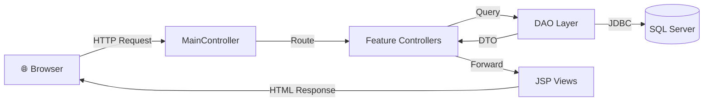
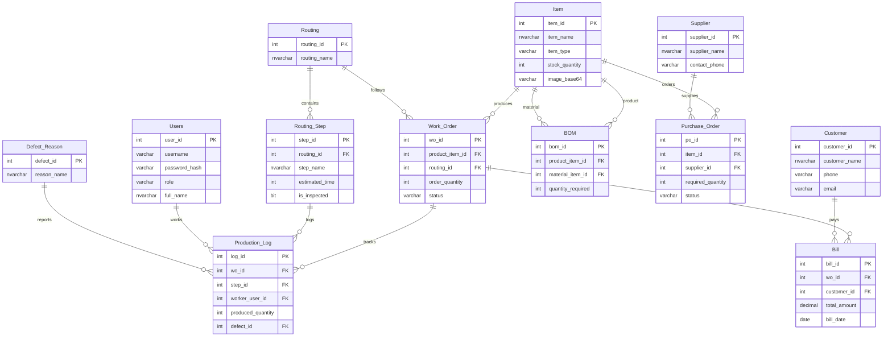

<p align="center">
  <h1 align="center">🏭 Production Management System</h1>
  <p align="center">
    <strong>A comprehensive web-based manufacturing management solution</strong>
  </p>
  <p align="center">
    
    
    
    
  </p>
</p>

---

## 📖 About

**Production Management System (PMS)** is a full-stack web application built with **Java Servlet/JSP** following the **MVC architecture**. It helps manufacturing businesses manage the entire production lifecycle — from **raw materials → manufacturing → delivery** — in an efficient and intuitive way.

> 💡 Developed as part of the **PRJ301 – Java Web Application Development** course at **FPT University**.

---

## ✨ Key Features

### 👤 User Management & Authentication
- Secure Login / Logout
- Role-based access control: **Admin** & **Employee**
- Full CRUD operations for employee accounts

### 📦 Item Management
- Unified management for **Products** and **Materials**
- 🖼️ Image upload & download (Base64 encoding)
- Search items by name

### 📜 Bill of Materials (BOM)
- Define product recipes: *1 Wooden Table = 2 Plywood + 20 Screws*
- Clear product ↔ material linking

### ⚙️ Production Routing
- **Routing**: Create master production processes
- **Routing Steps**: Define detailed steps (Cut Wood → Assemble → Inspect)
- Time estimation & inspection status tracking

### 📋 Work Orders
- Create production orders tied to products and routings
- Track status: `New` → `InProgress` → `Done`

### 🏭 Production Logs
- Record progress for each production step
- Track output quantities and defects
- Link workers ↔ steps ↔ work orders

### ⚠️ Defect Tracking
- Maintain a catalog of defect types
- Link defects to production logs for quality control

### 🏢 Supplier & Purchase Orders
- Manage supplier information
- Create material purchase requests
- Track order status

### 👥 Customer Management
- Store customer contact details
- Link customers to invoices

### 💵 Billing
- Generate invoices for completed orders
- Link work orders ↔ customers ↔ totals

---

## 🏗️ System Architecture

```
📂 production-management-system
├── 📂 src/java/pms
│   ├── 📂 controllers/      # 13 Servlet Controllers (MVC)
│   │   ├── MainController    # Central request dispatcher
│   │   ├── UserController    # Auth & user management
│   │   ├── ItemController    # Item management + image upload
│   │   ├── BomController     # Bill of Materials
│   │   └── ...               # + 9 more controllers
│   ├── 📂 model/             # DAO + DTO (Data Access Layer)
│   └── 📂 utils/             # DB Connection Utilities
├── 📂 web/                   # 27 JSP Views
│   ├── BangDieuKien.jsp      # Main Dashboard
│   ├── login.jsp             # Login Page
│   └── ...                   # Forms, Lists, Search pages
├── 📂 datebase/              # SQL Scripts
│   ├── Table.sql             # Schema (12 tables)
│   └── data.sql              # Sample data
└── 📂 lib/                   # JDBC Driver & JSTL
```

### MVC Flow



---

## 🗄️ Database Schema

The system uses **12 tables** organized into two tiers:

### Tier 1 — Independent Tables (No Foreign Keys)

| Table | Description |
|-------|-------------|
| `Users` | Authentication & role management |
| `Item` | Products and raw materials inventory |
| `Supplier` | Supplier contact information |
| `Customer` | Customer contact information |
| `Defect_Reason` | Catalog of defect types |
| `Routing` | Master production processes |

### Tier 2 — Dependent Tables (With Foreign Keys)

| Table | Depends On | Description |
|-------|------------|-------------|
| `Routing_Step` | Routing | Detailed steps within a process |
| `BOM` | Item × Item | Product recipe (product → materials) |
| `Purchase_Order` | Item, Supplier | Material purchase requests |
| `Work_Order` | Item, Routing | Production orders |
| `Production_Log` | Work_Order, Routing_Step, Users, Defect_Reason | Factory floor activity log |
| `Bill` | Work_Order, Customer | Invoices for completed orders |

### Entity Relationship Diagram



---

## 🚀 Getting Started

### Prerequisites

| Component | Version |
|-----------|---------|
| JDK | 8+ |
| Apache Tomcat | 9.x |
| SQL Server | 2019+ |
| IDE | NetBeans 12+ |

### Installation

**1. Clone the repository**
```bash
git clone https://github.com/ChickMan2211/production-management-system.git
```

**2. Set up the Database**
```sql
-- Run in SQL Server Management Studio (in order):
-- Step 1: Create tables
Table.sql

-- Step 2: Insert sample data
data.sql
```

**3. Configure Database Connection**

Edit `src/java/pms/utils/DBUtils.java`:
```java
String url = "jdbc:sqlserver://localhost:1433;databaseName=FactoryERD";
String user = "sa";
String password = "your_password";
```

**4. Build & Deploy**
- Open the project in **NetBeans**
- Configure **Tomcat Server**
- **Clean and Build** → **Run**
- Access: `http://localhost:8080/production-management-system/`

### Default Accounts

| Username | Password | Role | Full Name |
|----------|----------|------|-----------|
| `admin` | `123456` | Admin | Administrator |
| `congnhan1` | `123456` | Employee | Nguyen Van B |
| `congnhan2` | `123456` | Employee | Tran Van C |

---

## 🛠️ Tech Stack

| Layer | Technology |
|-------|------------|
| **Backend** | Java Servlet 4.0, JSP, JSTL |
| **Frontend** | HTML5, CSS3, JavaScript |
| **Database** | Microsoft SQL Server |
| **Server** | Apache Tomcat 9.x |
| **Architecture** | MVC Pattern |
| **Image Storage** | Base64 Encoding (Data URI) |
| **Build Tool** | Apache Ant |

---

## 📸 Image Upload Feature

The system supports **product image upload & download** using **Base64 encoding**:

- ✅ Direct upload from browser (supports JPG, PNG, GIF, etc.)
- ✅ Automatic content-type detection
- ✅ Stored in database as `VARCHAR(MAX)`
- ✅ Inline display using Data URI scheme
- ✅ One-click download to local machine

---

## 👨‍💻 Author

Developed by **ChickMann, bao-fox2005, nguyenminhphuc130705-create, Tung204** 🐔

> **PRJ301 – Java Web Application Development**
> **FPT University** 🎓

---

<p align="center">
  <sub>⭐ If you find this project useful, please give it a star on GitHub! ⭐</sub>
</p>
